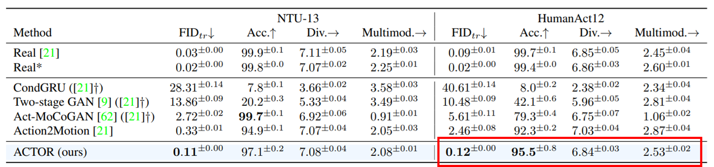
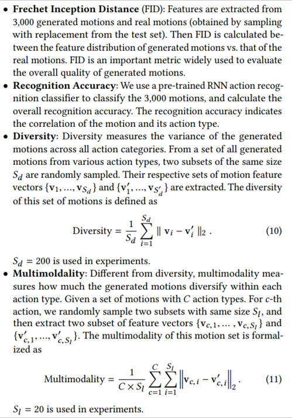

# ACTOR-mindspore


## 项目说明：

基于[HumanAct12](https://arxiv.org/pdf/2007.15240.pdf)数据集，使用Mindspore框架复现[ACTOR](https://openaccess.thecvf.com/content/ICCV2021/papers/Petrovich_Action-Conditioned_3D_Human_Motion_Synthesis_With_Transformer_VAE_ICCV_2021_paper.pdf)用于生成现实和多样化的人类运动序列的模型。

## 环境说明：

+ mindspore版本：2.0.0
+ 硬件平台：GPU CUDA 11.6
+ 操作系统：Linux-x86_64
+ 编程语言：Python 3.8

​		环境安装命令：

​		在ACTOR_mindspore-main目录下运行以下指令：

```
bash install_package.sh
```

## 文件说明：

+ data：数据集所在位置
+ exps：ckpt权重所在位置，训练日志和训练结果所在位置
+ models：模型预训练权重所在位置
+ prepare：数据集和模型预训练权重下载命令
+ REDME.assets：README图片位置
+ src：
  + dataset：数据集载入函数
  + evaluate：评价函数
  + generate：生成动作函数
  + models：模型架构
  + parser：超参数
  + preprocess：数据集预处理函数
  + recognition：获取模型函数
  + train：训练函数
  + utils：各类工具函数
  + config：路径超参数
+ environment.yml：环境说明
+ install_package.sh：环境配置命令
+ README.md：README说明文件
+ run.sh：训练和测试命令

## 目录格式：

```
--ACTOR_mindspore-main
	--data
		--HumanAct12Poses
			--humanact12poses.pkl
	--exps
		--humanact12
        	--checkpoint_0001.ckpt
        	--checkpoint_1000.ckpt
        	--evaluation_metrics_0001_all.yaml
        	--evaluation_metrics_1000_all.yaml
        	--opt.yaml
        	--training.log
	--models
		--actionrecognition
			--humanact12_gru.tar
			--ntu13_gru.tar
			--uestc_rot6d_stgcn.tar
		--smpl
			--J_regressor_extra.npy
			--kintree_table.pkl
			--SMPL_NEUTRAL.pkl
			--smplfaces.npy
	--prepare
		--download_datasets.sh
		--download_pretrained_models.sh
		--download_recognition_models.sh
		--download_smpl_files.sh
	--README.assets
		--image-20230922094953445.png
		--statement.png
	--src
		--datasets
		--evaluate
		--generate
		--models
		--parser
		--preprocess
		--recognition
		--train
		--utils
		--__init__.py
		--config.py
	--environment.yml
	--install_pakage.sh
	--README.md
	--run.sh
```

## 测试命令：

在ACTOR_mindspore-main目录下运行以下指令：

```python
python -m src.evaluate.evaluate_cvae exps/humanact12/checkpoint_1000.ckpt --batch_size 64 --niter 20 # 表示你在验证的在第 1000 epoch 训练的模型
```

## Mindspore测试结果：

```
训练1000个epoch的平均结果：
FID.：0.28			原论文FID.：0.12
Acc.：90.68			原论文Acc.：95.5
Div.：6.90			原论文Div.：6.84
Multimod.：2.92		原论文Multimod.：2.53
```





## 训练命令：

在ACTOR_mindspore-main目录下运行以下指令：

```python
python -m src.train.train_cvae --modelname cvae_transformer_rc_rcxyz_kl --pose_rep rot6d --lambda_kl 1e-5 --jointstype vertices --batch_size 20 --num_frames 60 --num_layers 8 --lr 0.0001 --glob --translation --no-vertstrans --dataset humanact12 --num_epochs 5000 --snapshot 100 --folder exps/humanact12
# 在ACTOR上训练 HumanAct12数据集，从1000epoch开始
# 设备：默认使用 GPU，若要更改，则可以在 src/train/train_cvae.py 中将 64 行进行更改
# 权重：可以在 src/train/train_cvae.py 中将 66、67 行进行注释，默认从1000epoch继续训练
```