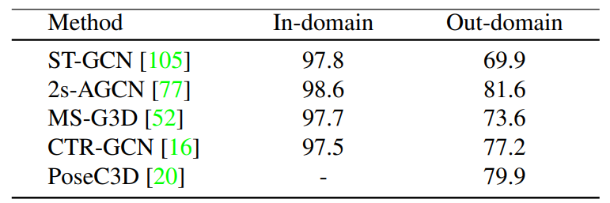

# ST-GCN,  AGCN, PoseC3D  MindSpore


## 项目说明：

基于[FLAG2D，FLAG3D](https://openaccess.thecvf.com/content/CVPR2023/papers/Tang_FLAG3D_A_3D_Fitness_Activity_Dataset_With_Language_Instruction_CVPR_2023_paper.pdf)数据集，使用Mindspore框架复现[ST-GCN](https://ojs.aaai.org/index.php/aaai/article/view/12328)，[AGCN](https://openaccess.thecvf.com/content_CVPR_2019/papers/Shi_Two-Stream_Adaptive_Graph_Convolutional_Networks_for_Skeleton-Based_Action_Recognition_CVPR_2019_paper.pdf)，[PoseC3D](https://openaccess.thecvf.com/content/CVPR2022/papers/Duan_Revisiting_Skeleton-Based_Action_Recognition_CVPR_2022_paper.pdf)三个用于视频人体运动预测的模型。

## 环境说明：

+ mindspore版本：2.1.1
+ 硬件平台：GPU CUDA 11.6
+ 操作系统：Linux-x86_64
+ 编程语言：Python 3.8

​		环境安装命令：

​		在GCN-C3D-mindspore目录下运行以下指令：

```
bash environment.sh
```

## 文件说明：

+ baseline：数据集载入需要经过的预处理说明（不参与运行）

+ chpk_resume：模型预训练权重

+ dataset：DataSet的载入方式

+ evaluation：评估函数

+ exp：测试的日志文件（不参与运行）

+ logs：日志函数

+ model：STGCN，AGCN，PoseC3D模型架构

+ README.assets：README图片储存

+ test：仅用于测试模型准确率

+ utils：将pth权重格式转为ckpt权重格式（不参与运行）

+ environment.sh：环境安装命令

+ README.md：README文件

+ train _ 模型 _ 数据集：训练模型文件

  ​	例：train_stgcn_flag2d.py：在FLAG2D上训练ST-GCN

## 目录格式：

```
--data
	--FLAG
		--flag2d.pkl
		--flag3d.pkl
--GCN-C3D-mindspore
	--baseline
	--chpk_resume
		--agcn_2d.ckpt
		--agcn_3d.ckpt
		--posec3d_2d.ckpt
		--stgcn_2d.ckpt
		--stgcn_3d.ckpt
	--dataset
	--evaluation
	--exp
	--logs
	--model
	--README.assets
	--test
	--utils
	--environment.sh
	--README.md
	--train_2sagcn_flag2d.py
	--train_2sagcn_flag3d.py
	--train_posec3d_flag2d.py
	--train_stgcn_flag2d.py
	--train_stgcn_flag3d.py
```

## 测试命令：

在GCN-C3D-mindspore目录下运行以下指令：

```python
python ./test/agcn_2d.py # 测试agcn在FLAG2D上的准确率
python ./test/agcn_3d.py # 测试agcn在FLAG3D上的准确率
python ./test/PoseC3D_2d.py # 测试PoseC3D在FLAG2D上的准确率
python ./test/stgcn_2d.py # 测试stgcn在FLAG2D上的准确率
python ./test/stgcn_3d.py # 测试stgcn在FLAG3D上的准确率
```

## Mindspore测试结果：

```
基于已有权重转换进行测试：
ST-GCN在FLAG2D上准确率：58.5	原论文准确率（Out-domain）：69.9
ST-GCN在FLAG3D上准确率：81.6	原论文准确率（In-domain）：97.8
AGCN在FLAG2D上准确率：81.5	原论文准确率（Out-domain）：81.6
AGCN在FLAG3D上准确率：98.6	原论文准确率（In-domain）：98.6
PoseC3D在FLAG2D上准确率：79.9 原论文准确率（Out-domain）：79.9
```



## 训练命令：

在GCN-C3D-mindspore目录下运行以下指令：

```python
python train_2sagcn_flag2d.py # 在FLAG2D上训练agcn
python train_2sagcn_flag3d.py # 在FLAG3D上训练agcn
python train_posec3d_flag2d.py # 在FLAG2D上训练PoseC3D
python train_stgcn_flag2d.py # 在FLAG2D上训练stgcn
python train_stgcn_flag3d.py # 在FLAG3D上训练stgcn
```


